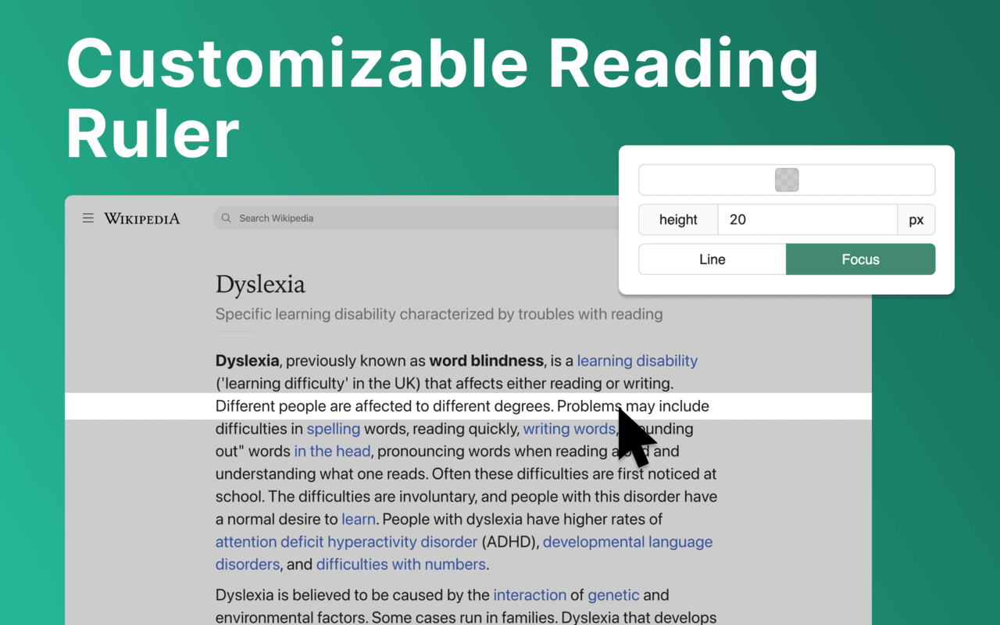

# Reader Line

Use Reader Line app to guide and enhance your experience with reading ruler to maintain your focus with reading line.

Introducing Reader Line: revolutionising your reading experience! 📕

## 🚀 Quick start tips
1. Click "Add to Chrome" to install the extension seamlessly into your browser.
2. Open any webpage or document where you want to enhance your reading experience.
3. Adjust the color, height, and opacity of the read ruler to your preferences.
4. Move the reading ruler with your mouse cursor to focus on specific lines or paragraphs.
5. Dive into your reading material with improved clarity and focus, courtesy of reading help!

## 💎 Enhance your reading journey with reader ruler
Reader line serves as your trusted reading companion, offering a range of features to cater to your unique reading needs. Whether you're a student, professional, or simply enjoy diving into a good book, focus ruler is here to elevate your reading journey.

## ⚙️ Customizable reading guide
Here are the options of read ruler you can easily customize in extension settings:

✴️ Color and opacity. Changing reading ruler color enhance readability on websites with different backgrounds.

✴️ Ruler height. By setting height of the reading guide user can adapt to different font sizes and line spacing for optimal reading experience.

✴️ Reading mode. Reader line offers two modes of reading: line and focus. These specialized modes offer tailored solutions to enhance your reading experience.

## ✨ Seamless integration and accessibility

💡 Reader line seamlessly integrates into your Chrome browser, ensuring accessibility and ease of use for users of all skill levels.

💡 Enable or disable the extension with just a click, giving you full control over your reading experience.

💡 Designed with inclusivity in mind, reader line prioritizes accessibility, making it a valuable tool for individuals with diverse reading needs.

## 🛠 Future features\n 

1️⃣ Focus mode. 

The focus mode feature enhances concentration by highlighting a single reader line, ideal for dyslexia. It utilizes the reading ruler to guide the reader's attention, making the reading line clearer and minimizing distractions, thus improving readability for dyslexic users.

2️⃣ PDF support. 

Seamlessly integrate read ruler's features into pdf files, offering a consistent reading experience across different formats and platforms. Whether you're studying academic papers, reviewing reports, or enjoying leisure reading, reading help will be there to provide invaluable support and assistance.

## ❓ Frequently asked questions

📌 What is reader line?

Reader line is a Chrome extension designed to improve your reading experience by providing a customizable line guide to help you navigate through text. Once installed, reading helper adds a virtual reading ruler to your browser window. You can adjust its color, height, and opacity to suit your preferences.

📌 Can it help with specific reading challenges?

Yes, reader line offers specialized modes such as dyslexia helper and focus line to assist individuals facing reading difficulties.

📌 Is reading line easy to use?

Absolutely! Reader line features an intuitive interface and can be enabled or disabled with just a click, making it accessible to users of all skill levels. Reading helper can be easily disabled or re-enabled with a single click, giving you full control over your reading experience.

📌 Can I customize the appearance of the reading guide?

Yes, you can customize the color, height, and opacity of the reading ruler to match your preferences and reading environment.

📌 Does reader line work on all websites?

Reading ruler is compatible with most websites and web-based documents, providing a consistent reading experience across various platforms.

📌 How can reading guide improve my reading speed and comprehension?

By providing a visual guide and minimizing distractions, reading ruler assist users focus on the text, leading to improved reading speed and comprehension.

📌 Is reader line suitable for students?

Yes, read ruler is an excellent tool for students, helping them stay focused while studying, researching, and reading academic texts.